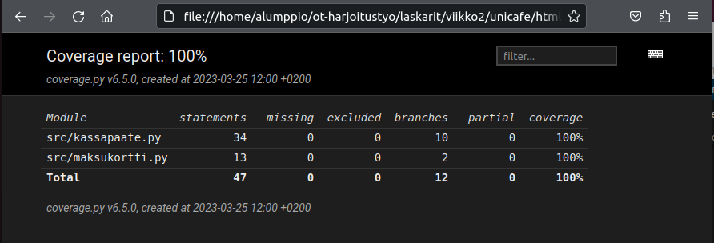

# Ohjelmistotekniikka, harjoitustyö, viikko1

## Ratkaisut

Tavallista tekstiä yksi (1) lause. **Lihavoitua tekstiä** ja * *kursivoitua tekstiä* *.	

[gitlog.txt](laskarit/viikko1/gitlog.txt)

[komentorivi.txt](laskarit/viikko1/komentorivi.txt)

muutos, joka kommitoidaan, mutta ei pushata gitiin

\
\
\
\ # Ohjelmistotekniikka, harjoitustyö, viikko2

## Ratkaisut

Testien lähdekoodit

[kassapaate_test.py](laskarit/viikko2/unicafe/src/tests/kassapaate_test.py)

[maksukortti_test.py](laskarit/viikko2/unicafe/src/tests/maksukortti_test.py)

**Ja epäoleellisempi maksukorttitesti lähdekoodi**

[maksukortti_test.py](laskarit/viikko2/maksukortti/src/tests/maksukortti_test.py)

### Coverage 100% kuvankaappaus

