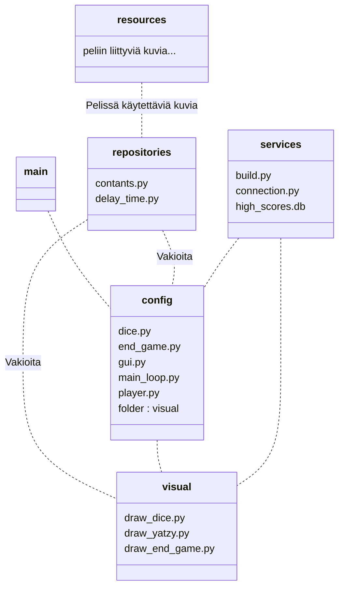
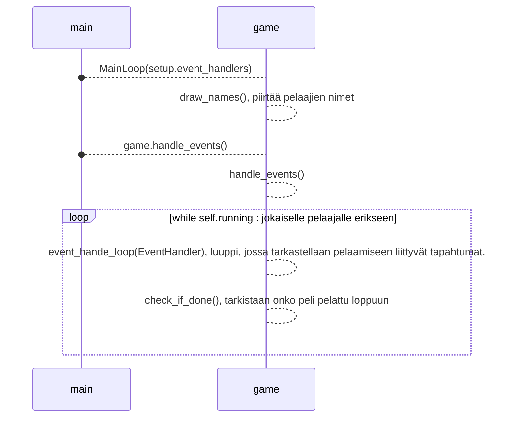

# Arkkitehtuurikuvaus


## Rakenne
Ohjelma koostuu useammasta tiedostosta ja pääpelilooppi suoritetaan tiedostossa main_loop.py. Itse pelikäynnistetään main.py tiedostolla. Kansiossa repositories on tiedosto constants.py, joka sisältää peliin liittyviä vakioita.



## Sovelluslogiikka

Sovelluslogiikkaan liittyvät tiedostot löytyvät config-kansiosta. 

Kansion tiedosto dice.py sisältää luokan Dices, jotka vastaavat jatsipelin viittä noppaa.

Tiedosto gui.py käsittelee pelin graafisessa käyttöliittymässä tapahtuvat tapahtumat luokassa EventHandler. Luokka käyttää tiedoston dice.py luokkaa Dices noppien luomiseen ja tiedoston player.py luokkaa Player jatsipelin tulospaperin luomiseen.

Tiedosto main_loop.py on nimensä mukaan pelin pääluuppi, joka tarkastelee tapahtuneet tapahtumat, ja tähän main_loop.py käyttää gui.py luokkaa EventHandler.

Tiedostoa player.py käytetään jatsipelissä tarvittavan tulospaperin luomiseen. Tiedoston luokka Player luo tulospaperin ja sisältää metodit pisteiden listaamiseen. player.py käyttää tiedoston dice.py luokkaa Dices noppien luomiseen

Tiedosto pygame_initial.py alustaa pygamen.

Kansiossa **visual** on pelin ruudun piirtämiseen liittyvät tiedostot

Kansion tiedosto draw_dice.py piirtää jatsipelin nopat ja käyttää noppien luomiseen config-kansion tiedoston dice.py Dices luokkaa. Tiedosto käyttää myös repositories-kansion constant.py tiedostoa, joka sisältää peliin liittyviä vakioita. 

Tiedosto draw_yatzy.py pirtää pelin jatsipaperin ja piirtää paperiin pisteet. draw_yatzy.py käyttää repositories-kansion constants.py tiedoston vakioita.


## Toiminta

Kun ohjelma main.py suoritetaan, niin ensiksi suoritetaan pelin alustus Setup-luokan olioilla, joka toimii sekvenssikaavion mukaisesti.

```mermaid
sequenceDiagram
    main()-->setup : Setup(), pelin alustamiseen käytettävä luokka
    constants-->setup : Tarvittavia vakioita ja pygame.init()
    main()-->setup : setup.game_setup(), aloittaa pelin alustuksen luupin, kuinka monta pelaajaa ja pelaajien nimet 
    setup-->setup : game_setup(), luupissa valitaan pelaajien määrä ja nimet
    setup-->setup : amount_setup()
    loop while self.running
        setup-->setup : amount_of_players_loop(), valitaan pelajaien määrä
        setup-->setup : draw_amount_setup(number), piirtää pelaajien määrän liittyvät asiat 
    end 
    setup-->setup : name_setup(int(players_amount)), valitaan haluttujen pelaajien nimet ja lisätään nimettyjen pelaajien Player-luokka olioit setup.players listaan.
    player-->setup : Player(), Player-luokan olio, joka vastaa jatsipelin pistetaulukkoa ja sen käsittelyyn liittyviä toimintoja.
    loop while self.running : kaikille pelaajille erikseen for-luupilla
        setup-->setup : name_setup_loop(), valitaan pelaajan nimi 
    end
    setup-->setup : convert_to_event_handlers(), jokaiselle pelaajalle
    dices-->setup : Dices(), jatsipelin noppia vastaavat oliot
    gui-->setup : EventHandler(Dices(), player, pelaajan_numero), alustetaan Player-luokan oliosta EventHandler-luokan olio mainlooppia varten. Tämä luokka käsittelee pelin käyttäjän aiheuttamat tapahtumat eli hiiren klikkaukset-
    setup-->main() : setup.event_handlers
    
    
```
Tämän jälkeen main tiedostossa luodaan pelin pääluuppiin liittyvä MainLoop-luokan olio, jota käytetään kaavion mukaisesti



Nyt event_handlerin luupissa mainittu event = pygame.event.get(). 

## Heikkoudet

Hetkellä peliä ei voi lopettaa mitenkään muuten kuin sulkemalla tiedoston. Toinen suuri heikkous pelissä on vahinkoklikkausta huomiotta jättäminen. Nyt jos pelissä painaa vahingossa ohi oikeasta kohdasta menettää noppansa. Tällöin pahimmassa tapauksessa ruksata yli kohdan, vaikka olisi mahdollista saada johonkin toiseen kohtaan tulos.
