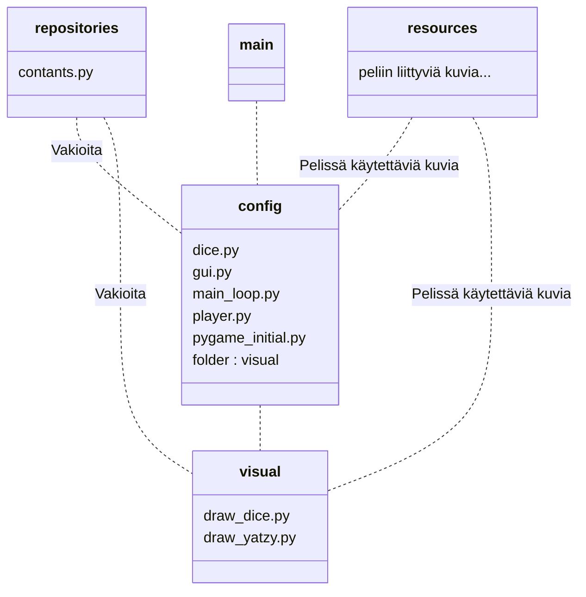

# Arkkitehtuurikuvaus


## Rakenne
Ohjelma koostuu useammasta tiedostosta ja pääpelilooppi suoritetaan tiedostossa main_loop.py. Itse pelikäynnistetään main.py tiedostolla. Kansiossa repositories on tiedosto constants.py, joka sisältää peliin liittyviä vakioita.



## Sovelluslogiikka

Sovelluslogiikkaan liittyvät tiedostot löytyvät config-kansiosta. 

Kansion tiedosto dice.py sisältää luokan Dices, jotka vastaavat jatsipelin viittä noppaa.

Tiedosto gui.py käsittelee pelin graafisessa käyttöliittymässä tapahtuvat tapahtumat luokassa EventHandler. Luokka käyttää tiedoston dice.py luokkaa Dices noppien luomiseen ja tiedoston player.py luokkaa Player jatsipelin tulospaperin luomiseen.

Tiedosto main_loop.py on nimensä mukaan pelin pääluuppi, joka tarkastelee tapahtuneet tapahtumat, ja tähän main_loop.py käyttää gui.py luokkaa EventHandler.

Tiedostoa player.py käytetään jatsipelissä tarvittavan tulospaperin luomiseen. Tiedoston luokka Player luo tulospaperin ja sisältää metodit pisteiden listaamiseen. player.py käyttää tiedoston dice.py luokkaa Dices noppien luomiseen

Tiedosto pygame_initial.py alustaa pygamen.

Kansiossa **visual** on pelin ruudun piirtämiseen liittyvät tiedostot

Kansion tiedosto draw_dice.py piirtää jatsipelin nopat ja käyttää noppien luomiseen config-kansion tiedoston dice.py Dices luokkaa. Tiedosto käyttää myös repositories-kansion constant.py tiedostoa, joka sisältää peliin liittyviä vakioita. 

Tiedosto draw_yatzy.py pirtää pelin jatsipaperin ja piirtää paperiin pisteet. draw_yatzy.py käyttää repositories-kansion constants.py tiedoston vakioita.


## Toiminta

Kun ohjelma main.py suoritetaan, tapahtuu seuraava:

```mermaid
sequenceDiagram
    main()-->Start() : Alustaa pygamen
    main()-->dices : Dices()
    main()-->player : Player()
    main()-->game : MainLoop(dices, player)
    game-->game : game.handle.events()

```

## Heikkoudet

Hetkellä peliä ei voi lopettaa mitenkään muuten kuin sulkemalla tiedoston. Toinen suuri heikkous pelissä on vahinkoklikkausta huomiotta jättäminen. Nyt jos pelissä painaa vahingossa ohi oikeasta kohdasta menettää noppansa. Tällöin pahimmassa tapauksessa ruksata yli kohdan, vaikka olisi mahdollista saada johonkin toiseen kohtaan tulos.