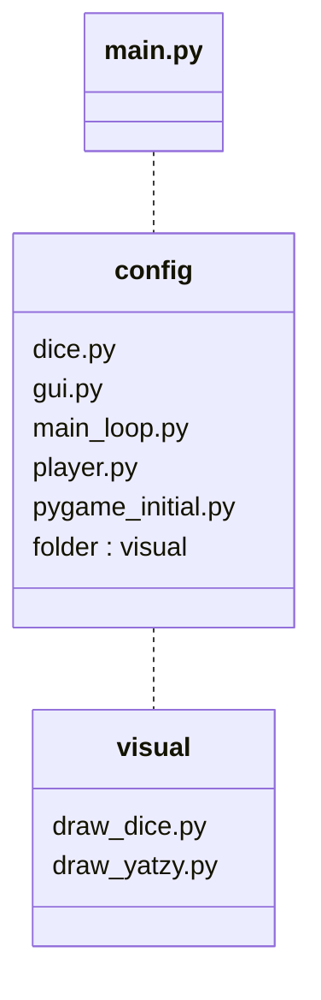

# Arkkitehtuurikuvaus

## Rakenne
Ohjelma koostuu useammasta tiedostosta ja pääpelilooppi suoritetaan tiedostossa main_loop.py. Itse pelikäynnistetään main.py tiedostolla. 

```mermaid
classDiagram
    main.py .. config
    config .. visual

    class config{
        dice.py
        gui.py
        main_loop.py
        player.py
        pygame_initial.py
        folder : visual
    }

    class visual{
        draw_dice.py
        draw_yatzy.py
    }
```

## Sovelluslogiikka

