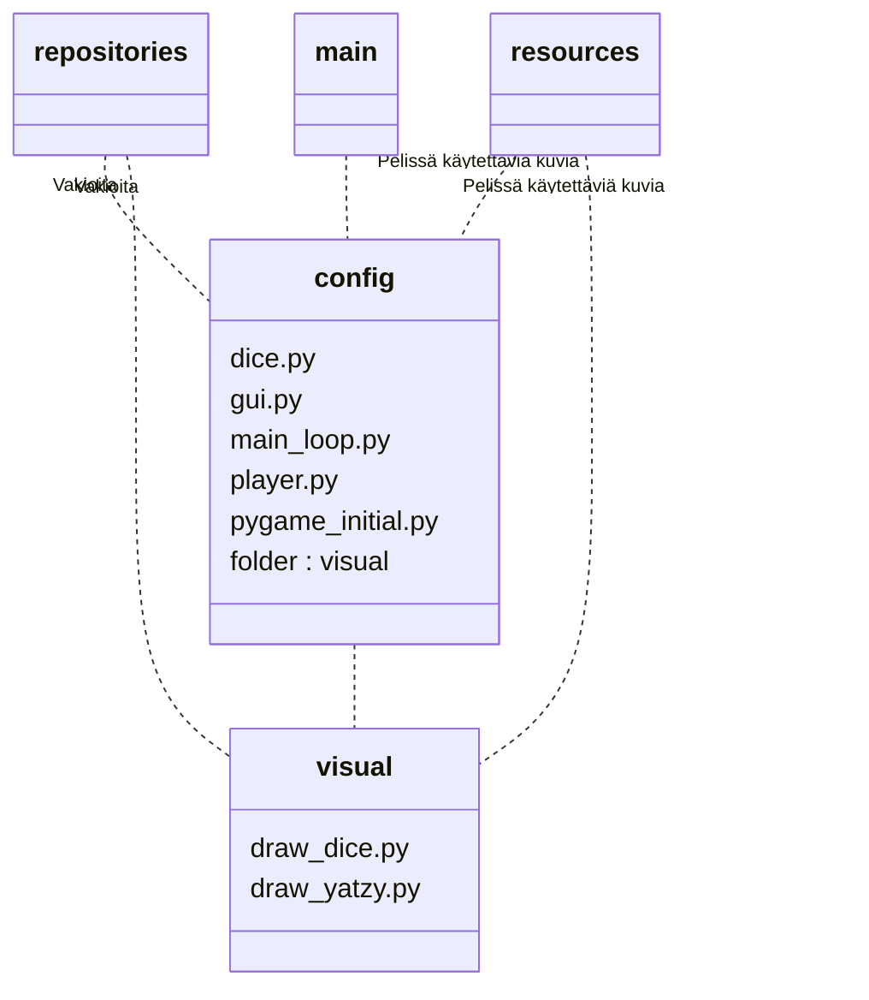

# Arkkitehtuurikuvaus

## Rakenne
Ohjelma koostuu useammasta tiedostosta ja pääpelilooppi suoritetaan tiedostossa main_loop.py. Itse pelikäynnistetään main.py tiedostolla. 

## Sovelluslogiikka

Sovelluslogiikkaan liittyvät tiedostot löytyvät config-kansiosta. 

Kansion tiedosto dice.py sisältää luokan Dices, jotka vastaavat jatsipelin viittä noppaa.

Tiedosto gui.py käsittelee pelin graafisessa käyttöliittymässä tapahtuvat tapahtumat luokassa EventHandler. Luokka käyttää tiedoston dice.py luokkaa Dices noppien luomiseen ja tiedoston player.py luokkaa Player jatsipelin tulospaperin luomiseen.

Tiedosto main_loop.py on nimensä mukaan pelin pääluuppi, joka tarkastelee tapahtuneet tapahtumat. main_loop.py käyttää gui.py luokkaa EventHandler

Tiedostoa player.py käytetään jatsipelissä tarvittavan tulospaperin luomiseen. Tiedoston luokka 

