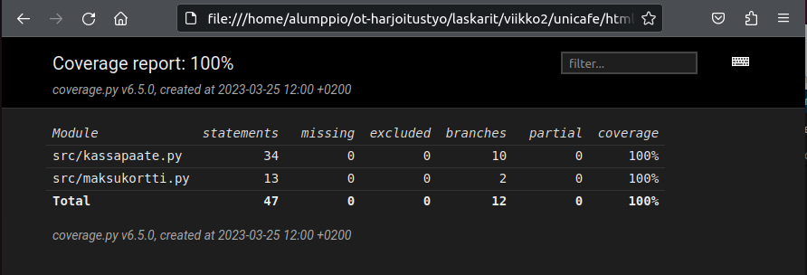

# Ohjelmistotekniikka, harjoitustyö, viikko2

## Ratkaisut

Testien lähdekoodit

[kassapaate_test.py](unicafe/src/tests/kassapaate_test.py)

[maksukortti_test.py](unicafe/src/tests/maksukortti_test.py)

**Ja epäoleellisempi maksukorttitesti lähdekoodi**

[maksukortti_test.py](maksukortti/src/tests/maksukortti_test.py)

### Coverage 100% kuvankaappaus

