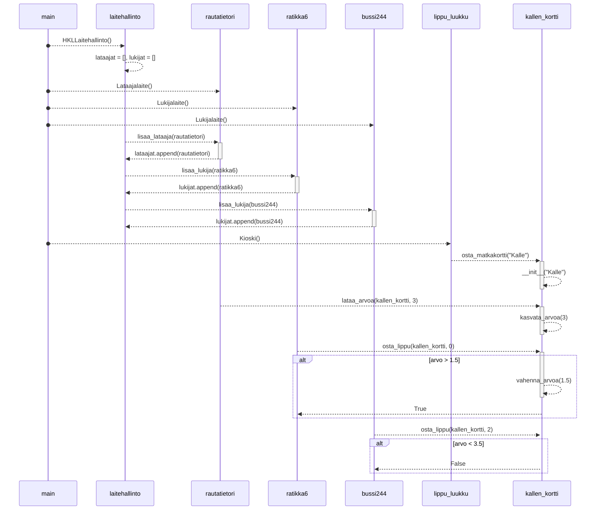

```mermaid
sequenceDiagram
    main()-->>laitehallinto: HKLLaitehallinto()
    laitehallinto-->>laitehallinto: lataajat = [], lukijat = []
    main()-->>rautatietori: Lataajalaite()
    main()-->>ratikka6: Lukijalaite()
    main()-->>bussi244: Lukijalaite()

    laitehallinto-->>+rautatietori: lisaa_lataaja(rautatietori)
    rautatietori-->>-laitehallinto: lataajat.append(rautatietori)
    
    laitehallinto-->>+ratikka6: lisaa_lukija(ratikka6)
    ratikka6-->>-laitehallinto: lukijat.append(ratikka6)

    laitehallinto-->>+bussi244: lisaa_lukija(bussi244)
    bussi244-->>-laitehallinto: lukijat.append(bussi244)

    main()-->>lippu_luukku: Kioski()
    lippu_luukku-->>+kallen_kortti: osta_matkakortti("Kalle")
    kallen_kortti-->>-kallen_kortti: __init__("Kalle")

    rautatietori-->>+kallen_kortti: lataa_arvoa(kallen_kortti, 3)
    kallen_kortti-->>-kallen_kortti: kasvata_arvoa(3)

    ratikka6-->>+kallen_kortti: osta_lippu(kallen_kortti, 0)
    alt arvo > 1.5
        kallen_kortti-->>-kallen_kortti: vahenna_arvoa(1.5)
        kallen_kortti-->>ratikka6: True
    end

    bussi244-->>+kallen_kortti: osta_lippu(kallen_kortti, 2)
    alt arvo < 3.5
        kallen_kortti-->>bussi244: False
    end
```
