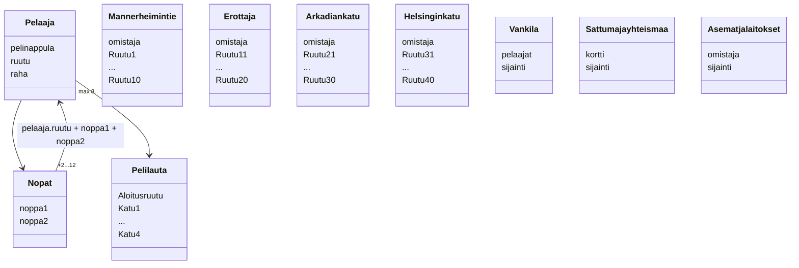

#Viikko3 tehtävä 2: Laajennettu monopoli 

```mermaid 

  classDiagram
      Pelaaja --> Nopat
      Nopat "+2...12" --> Pelaaja : pelaaja.ruutu + noppa1 + noppa2
      Pelaaja "min 2. max 8." --> Pelilauta

    class Pelilauta{
        Aloitusruutu
        Katu1
        ...
        Katu4

    }


    class Mannerheimintie{
        omistaja
        Ruutu1
        ...
        Ruutu10
    }


    class Erottaja{
        omistaja
        Ruutu11
        ...
        Ruutu20
    }

    class Arkadiankatu{
        omistaja
        Ruutu21
        ...
        Ruutu30
    }


    class Helsinginkatu{
        omistaja
        Ruutu31
        ...
        Ruutu40
    }

    class Nopat{
        noppa1
        noppa2
    }


      class Pelaaja{
          pelinappula
          ruutu
          raha
      }    


    class Vankila{
        pelaajat
        sijainti
    }

    class Sattuma ja yhteismaa{
        kortti
        sijainti
    }

    class Asemat ja laitokset{
        omistaja
        sijainti
    }


```

