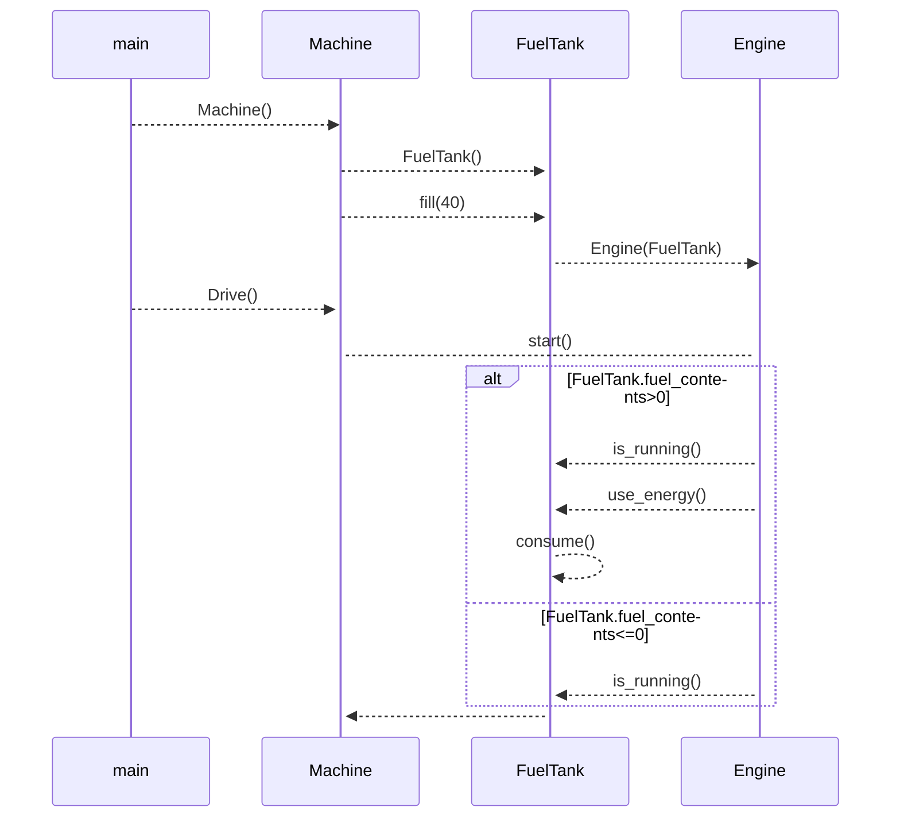

```mermaid
sequenceDiagram
    main-->>Machine: Machine()
    Machine-->>+FuelTank: FuelTank()
    Machine-->>FuelTank: fill(40)
    FuelTank-->>Engine: Engine(FuelTank)
    main-->>+Machine: Drive() 
    Machine-->+Engine: start()
    alt FuelTank.fuel_contents>0
        Engine-->>FuelTank: is_running()
        Engine-->>FuelTank: use_energy()
        FuelTank-->>FuelTank: consume()
    else FuelTank.fuel_contents<=0
        Engine-->>FuelTank: is_running()
        
    end
    FuelTank-->>Machine: 
    
```
